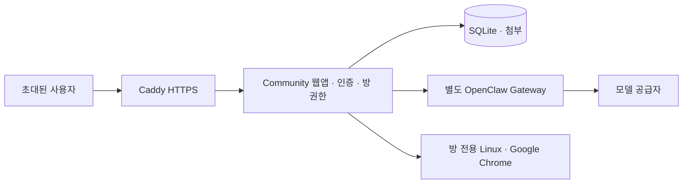
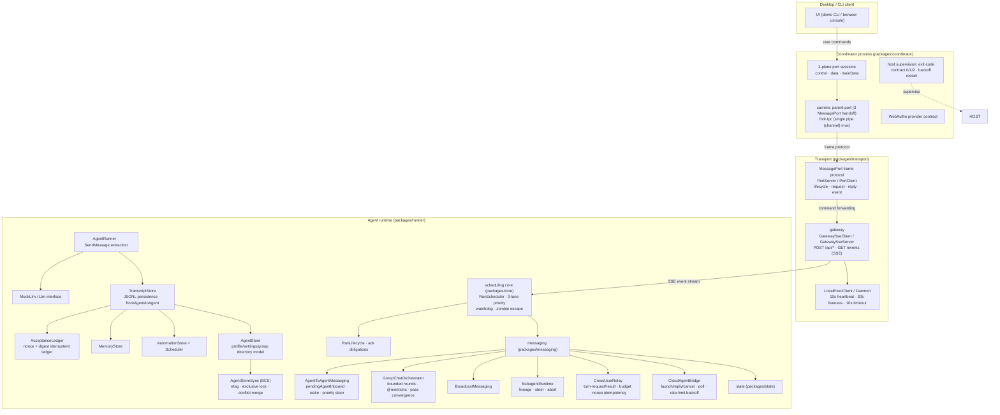

# OpenClawBot community app

이 fork에는 [Open-Grokbot upstream](https://github.com/LING71671/open-grokbot)의 GPL-3.0-only clean-room 프레임워크를 바탕으로 구현한 초대 기반 사용자 커뮤니티 웹앱이 추가되어 있습니다. 원본 프레임워크의 구조·런타임·프로토콜 문서는 아래에 유지하며, 이번 커뮤니티 앱의 코드는 계정 인증, 방별 ACL, 첨부파일, Docker/OCI 배포, 브라우저 데스크톱 프록시, OpenClaw adapter에 집중합니다.

- 앱 안내와 실행: [apps/community/README.md](apps/community/README.md)
- 라이브 링크: [https://168.107.91.96](https://168.107.91.96)
- 포트폴리오 요약: [docs/portfolio-ko.md](docs/portfolio-ko.md)
- OCI 운영 스킬: [.agents/skills/oci-openclaw-ops/SKILL.md](.agents/skills/oci-openclaw-ops/SKILL.md)
- 보안 범위와 제보: [SECURITY.md](SECURITY.md)

라이브 앱은 OpenClaw 2.0 계열 `2026.9.5`의 별도 Gateway에 연결되어 있습니다. 실제 모델 응답과 공동 브라우저의 페이지 이동·내용 확인을 검증했습니다. 초대 계정으로 로그인해 사용하며, provider/API key는 서버에만 보관합니다. PWA 설치와 브라우저별 Web Push 수신은 실제 배포 환경에서 아직 검증하지 않았습니다. 이미지·음성 첨부와 재생을 지원하지만 이미지 인식과 음성 전사는 구현하지 않았고, 방별 데스크톱은 운영자가 별도로 생성해야 합니다.



[GitHub CI](https://github.com/minwoo19930301/OpenClawBot/actions/workflows/ci.yml)는 Node.js 24에서 전체 빌드·테스트·타입 검사를 실행합니다. 테스트 범위는 소스의 현재 test runner 결과를 기준으로 하며, 공개 부하 테스트 결과를 의미하지 않습니다.

원본 상용 Grok Bot의 유출 소스·자산·비공개 자격 증명은 포함하지 않습니다. 공개 upstream 프레임워크의 코드와 GPL 라이선스는 유지하며, 출처와 추가 구현 범위는 [LICENSE](LICENSE)와 [apps/community/README.md](apps/community/README.md)에 명시합니다.

## Upstream framework

[简体中文](README.zh.md)

An open-source multi-agent communication & coordination framework — a **full architectural re-implementation** of a modern desktop agent platform (Grok Bot class). Blueprinted from reverse-engineered architecture, it rebuilds every layer of the multi-agent system: process topology, port protocols, SSE gateway, exclusive scheduling, messaging protocols, group-chat orchestration, cross-user rooms, a cloud-agent bridge, idempotent ledgers and persistent state.

> ## ⚠️ Important notice
>
> **This project is a reverse-engineered re-implementation, NOT the original source code.**
> The code in this repository is written from scratch (clean-room reimplementation) based on
> static reverse-engineering of the Grok Bot binary (and the Cursor build chain it is based on):
> unpacking, sourcemap recovery and architecture analysis. It contains no source code,
> assets or proprietary material from the original product; the architecture and protocols
> are independently implemented with reference to the observed public behavior.
>
> **License: GNU GPL v3 only (SPDX: GPL-3.0-only)** — see [LICENSE](LICENSE).
>
> Grok Bot, Cursor and their names, trademarks and logos belong to their respective owners.
> This project claims no rights over those names/trademarks and has no affiliation with the
> original product. Code, naming and docs here serve architectural study and engineering
> reference only.

## Architecture overview



## Quick start

```bash
npm install
npm run build          # full build (tsc project references)
npm test               # all tests (node:test)
npm run demo           # full demo: user chat + A2A + group chat + broadcast
npm run start -w @open-grokbot/console   # browser control plane (no Electron)
```

Sample demo output:

```
--- 2. agent-to-agent: Alpha -> Beta ---
  ack: Sent to Beta. This is asynchronous; ...
  [beta/send-message] Thanks for the note, Alpha! I'll take a look.

--- 4. group chat: Squad discusses the roadmap ---
  [squad/group] Alpha: good point — @Beta what do you think?
  ...
```

## Real LLM integration (any model)

```ts
import { createLlm, createLlmFromEnv } from "@open-grokbot/llm";

// OpenAI-compatible protocol: OpenAI / DeepSeek / Doubao / Moonshot / GLM /
// Grok / Ollama / vLLM and every OpenAI-compatible endpoint
const deepseek = createLlm({
  provider: "openai-compatible",
  baseUrl: "https://api.deepseek.com/v1",
  apiKey: process.env.DEEPSEEK_API_KEY!,
  model: "deepseek-chat",
});

// Anthropic protocol
const claude = createLlm({
  provider: "anthropic",
  apiKey: process.env.ANTHROPIC_API_KEY!,
  model: "claude-sonnet-4-5",
});

// Environment-driven (the console's default path)
// LLM_PROVIDER=anthropic  ANTHROPIC_API_KEY=…  ANTHROPIC_MODEL=…
// or (default) OPENAI_API_KEY=…  OPENAI_BASE_URL=…  OPENAI_MODEL=…
const llm = createLlmFromEnv();
```

Start the console and open `http://127.0.0.1:<port>` to chat (falls back to MockLlm when no key is configured).

## Delivery form

No Electron dependency and no EXE output. Two surfaces:

- **CLI**: `npm run demo` — chat / a2a / group / broadcast / transcript
- **Browser control plane**: `npm run console` — HTTP + SSE server (apps/console);
  open the printed URL to chat with the agents, send A2A messages, broadcast,
  and watch the live event stream

The shell is decoupled from the runtime: the control plane only speaks HTTP/SSE,
so swapping in any other shell (Node SEA, Bun compile, Tauri, …) later requires
no changes inside packages/*.

## Packages

| Package | Responsibility | Original counterpart |
|---|---|---|
| `@open-grokbot/core` | Exclusive run queue (3-lane priority), watchdog escape, run lifecycle, retry/deadline/idle policies, event bus | dune scheduling + RunScheduler/RunLifecycle |
| `@open-grokbot/coordinator` | Coordinator process: 3-plane ports, dual carriers (parent-port / fork-ipc), host supervision exit-code contract, RPC contract, WebAuthn | node-agent-coordinator / carrier |
| `@open-grokbot/transport` | MessagePort frame protocol, HTTP+SSE gateway, 16 event families, local-exec channel | renderer-port-server / gateway-client / gateway-server |
| `@open-grokbot/state` | Transcript (JSONL), acceptance ledger, memory, automations, agent store, BCS multi-device sync | transcript / send-acceptance / agent-store-sync |
| `@open-grokbot/messaging` | A2A DMs, group orchestration, broadcast, subagent runtime, cross-user relay, cloud-agent bridge | agent-to-agent-messaging / group-chat-orchestrator / cross-user-sharing / cloud-agents |
| `@open-grokbot/llm` | LLM abstraction, OpenAI-compatible + Anthropic providers, deterministic mock | chat-inference adapter |
| `@open-grokbot/runner` | Turn execution, SendMessage extraction, SessionRuntime composition root | sand-agent-runner / host composition |
| `@open-grokbot/demo` | CLI: chat / a2a / group / broadcast / transcript | — |
| `@open-grokbot/console` | Browser control plane: HTTP API + SSE live feed + embedded chat UI | — |

## Core mechanisms

- **Exclusive run queue**: one queue per agent, one active turn at a time; `user > agent > background` lane priority keeps user messages first.
- **Watchdog escape**: wedged runs escape after the grace window into a zombie — the caller's promise settles immediately (sends never hang), while drain/delete still wait for the true stop.
- **A2A messages**: fire-and-forget + symmetric wake; priority messages interrupt non-user work (steer); DM preemption re-drives at-least-once (isRedriven guards loops); both transcripts mirror the exchange + social graph.
- **Group chat**: bounded rounds (message cap / round cap / pass convergence / user supersede), @mention routing, per-member session state.
- **Cross-user rooms**: hosted/mirror rooms, turn-request/turn-result protocol, 30 turns / 10 min budget, unreachable backoff, nonce idempotency.
- **Cloud-agent bridge**: launch/reply/cancel/rename, 10s poll, 30s RPC timeout, 5h cap, 60s±25% rate-limit jitter.
- **Idempotent sends**: clientNonce + inputDigest persistent ledger; timeouts never double-send; durable acceptance decouples send from execution.
- **Broadcast**: one-way user→agents fan-out, sequential scheduling, concurrent execution, no loops.
- **Subagent**: parent-derived background runs with lineage, steer and abort.
- **Multi-device sync (BCS)**: etag conditional writes, exclusive mutation lock, merge-on-conflict.
- **Persistence**: per-agent directory (transcript.jsonl / memory.json / automations.json / profile.json / settings.json / group.json).

## Documentation

- [Architecture](docs/architecture.md) — process topology, layering, data flows, sequence diagrams
- [Protocol](docs/protocol.md) — frame protocol, SSE wire, A2A/group/broadcast/xuser/cloud contracts
- [Restoration matrix](docs/restoration-matrix.md) — original module ↔ implementation ↔ test coverage

## Tests

```bash
npm test
```

Covers: lane priority, exclusivity, watchdog escape + drain, port protocol breaches, SSE reconnect + idempotent sendPrompt retry, transcript persistence, ledger dedupe/digest-mismatch/restart survival, A2A wake + priority interrupt, group convergence/caps, broadcast, subagent lifecycle, coordinator dual carriers, cross-user relay budget/backoff/idempotency, cloud-agent lifecycle, local-exec heartbeat/timeout, BCS conflicts/locks, LLM provider wire formats, e2e (user→agent, A2A wake→reply, group chat). Run `npm test` for all workspace suites; the community app suite currently has 34 tests.

## Roadmap

- [x] Real LLM integration (OpenAI-compatible + Anthropic)
- [x] Browser control plane (HTTP + SSE, no Electron)
- [ ] Web UI polish (transcript rendering, group view, social graph)
- [ ] Coordinator as a real utility process (Electron) — or any other shell via the decoupled HTTP/SSE surface

## License

GNU GPL v3 only (SPDX: GPL-3.0-only)
