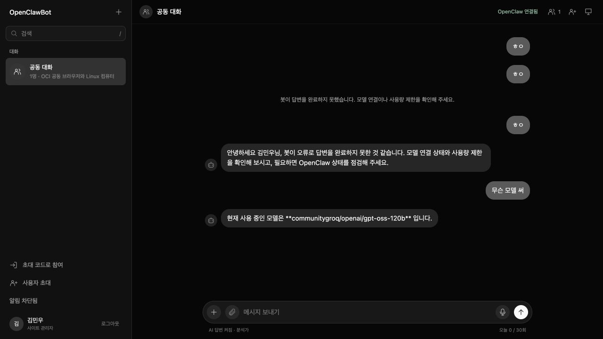
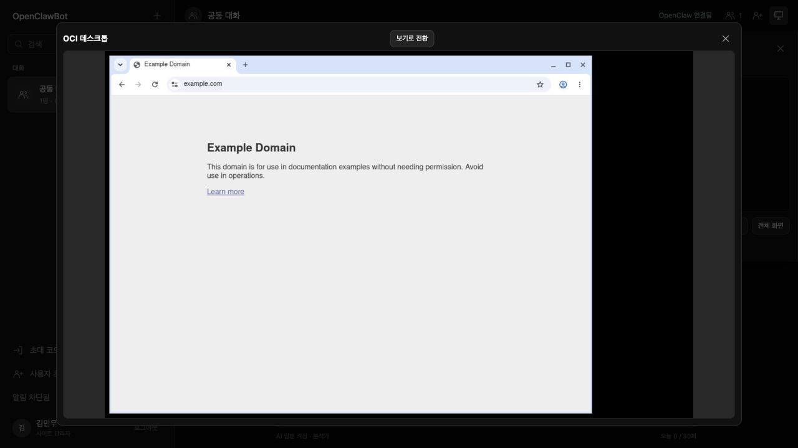
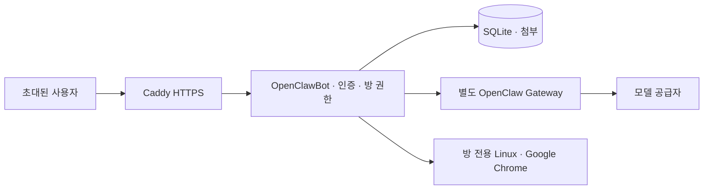

# OpenClawBot

<p align="center">
  <strong>함께 대화하고, 같은 Chrome을 조작하는 OpenClaw 커뮤니티</strong>
</p>
<p align="center">
  <a href="https://168.107.91.96/"></a>
  <a href="https://github.com/minwoo19930301/OpenClawBot/actions/workflows/ci.yml"></a>
</p>
<p align="center">
  <a href="https://168.107.91.96/"><strong>↗ OpenClawBot 접속</strong></a> ·
  <a href="apps/community/README.md">사용 안내</a> ·
  <a href="docs/portfolio-ko.md">프로젝트 소개</a> ·
  <a href=".agents/skills/oci-openclaw-ops/SKILL.md">OCI 운영 스킬</a>
</p>

> **접속 주소:** https://168.107.91.96/ · 초대 기반 서비스입니다. 기존 회원은 아이디와 비밀번호로 로그인합니다. 가입 코드와 API 키는 공개하지 않습니다.
>
> **홈 화면 앱(PWA):** 현재 HTTPS IP 주소를 그대로 사용합니다. 홈 화면에 추가한 뒤 로그인하고 **알림 켜기 → 테스트 알림 보내기**로 기기 수신을 확인하세요. 실제 설치·알림 지원은 브라우저와 기기 설정에 따라 다릅니다.

## 실제 화면

현재 운영 중인 서비스에서 직접 캡처한 화면입니다.

### 공동 대화



초대된 참여자가 같은 방에서 대화하고, 선택한 봇의 답변을 함께 확인합니다. 캡처에는 이전 연결 점검 중의 오류 메시지도 대화 기록으로 남아 있습니다.

### Linux 데스크톱 · Google Chrome



대화방의 OCI 데스크톱을 확대해 직접 조작합니다. 위 화면은 실제 Linux 컨테이너에서 실행 중인 Google Chrome으로 Example Domain을 연 모습입니다.

## 할 수 있는 일

| 기능 | 설명 |
| --- | --- |
| 공동 대화와 AI 답변 | 초대 기반 계정, 방별 참여 권한, OpenClaw Gateway를 통한 모델 응답 |
| 공동 브라우저 | 같은 방의 참여자가 Linux의 Google Chrome을 보고 조작 |
| AI 브라우저 도구 | 연결된 방에서 페이지 이동·내용 확인 등의 브라우저 작업 |
| 사진·음성 | 파일 첨부, 브라우저 음성 녹음과 재생 |
| 홈 화면 앱 | HTTPS IP 주소에서 PWA 설치와 Web Push 알림 |
| OCI 운영 | Docker Compose 배포, 별도 AI Gateway, 재사용 가능한 운영 스킬 |

사진·음성의 **첨부와 재생**을 지원하며, 이미지 인식과 음성 전사는 아직 구현하지 않았습니다. 방별 데스크톱은 운영자가 별도로 연결해야 합니다. 휴대폰의 실제 PWA 설치와 OS 알림 수신은 기기에서 추가 확인이 필요합니다.

## 구성



OCI Ampere A1에서 Docker로 웹앱, OpenClaw Gateway, 원격 데스크톱, HTTPS 프록시를 분리해 운영합니다. 라이브 앱은 OpenClaw `2026.9.5` Gateway에 연결되어 있으며, 실제 모델 응답과 브라우저 페이지 이동을 검증했습니다. 모델 API 키와 가입 코드는 공개 저장소에 포함하지 않습니다.

## 로컬 실행

Node.js 24 이상에서 저장소 루트 기준으로 실행합니다.

```sh
npm ci --ignore-scripts
npm run build -w @open-grokbot/runner -w @open-grokbot/llm -w @open-grokbot/community
npm start -w @open-grokbot/community
```

환경 변수는 [설정 예시](apps/community/.env.example)를 참고해 실행 환경에 전달합니다. 최초 관리자 가입에는 `COMMUNITY_BOOTSTRAP_TOKEN`이 필요하고, 이후에는 관리자 메뉴에서 사용자 초대를 발급합니다. AI 연결과 배포 설정은 아래 문서를 참고하세요. 내부 workspace 이름은 기존 패키지 호환성을 위해 유지합니다.

## 문서와 검증

- [사용 안내 · 환경 설정](apps/community/README.md)
- [Docker · OCI 배포](apps/community/deploy/README.md)
- [Linux · Chrome 데스크톱](apps/community/deploy/desktop/README.md)
- [OCI 운영 스킬](.agents/skills/oci-openclaw-ops/SKILL.md)
- [포트폴리오 소개](docs/portfolio-ko.md)
- [보안 정책](SECURITY.md)
- [GitHub CI](https://github.com/minwoo19930301/OpenClawBot/actions/workflows/ci.yml)

```sh
npm run build
npm test
npm run typecheck
```

CI는 Node.js 24에서 빌드·테스트·타입 검사를 실행합니다. 앱 테스트는 인증, 방 권한, 초대, 첨부, 데스크톱 프록시, 모델 도구 루프와 PWA/Web Push 계약을 확인합니다.

## 라이선스 · 출처

[GNU GPL v3 only](LICENSE) (`GPL-3.0-only`). 공개 [LING71671/open-grokbot](https://github.com/LING71671/open-grokbot) 프레임워크를 바탕으로 OpenClawBot의 공동 대화, 계정·초대, 미디어 첨부, OCI 데스크톱, OpenClaw 연동과 PWA 기능을 추가했습니다. 원본의 저작권·라이선스 고지는 유지합니다. 원본 상용 제품과 제휴하지 않으며, 해당 제품의 유출 소스·자산·비공개 자격 증명은 포함하지 않습니다.
