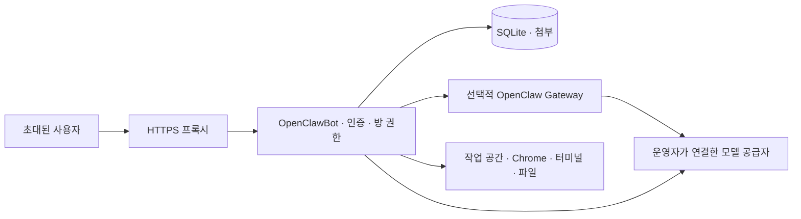

# OpenClawBot


직접 호스팅하는 초대 기반 AI 작업 공간입니다. 대화와 모델 선택, 공유 브라우저, 터미널, 파일 탐색기를 한 화면에서 사용합니다.

[로컬 실행](#로컬-실행) · [환경 설정](apps/community/README.md) · [배포 안내](apps/community/deploy/README.md) · [CI 구성](.github/workflows/ci.yml)

## Fork 후 준비

서버, 도메인, AI 공급자, 외부 서비스 계정은 설치하는 운영자가 선택하고 등록합니다. [환경 변수 예시](apps/community/.env.example)의 빈 항목을 필요한 기능에 맞게 채우세요.

| 항목 | 준비할 설정 |
| --- | --- |
| 계정과 데이터 | 새 데이터 디렉터리, 최초 관리자용 `COMMUNITY_BOOTSTRAP_TOKEN` |
| 서버와 HTTPS | 운영할 서버, 자신의 공개 주소, 인증서와 프록시 설정 |
| AI | 사용할 공급자의 API 키·모델 또는 전용 OpenClaw Gateway 주소·토큰 |
| 브라우저·터미널·파일 | 작업 공간 컨테이너와 서버 측 연결 설정 |
| Cloudflare | DNS나 프록시에 사용할 경우 자신의 계정·영역·권한 범위가 지정된 토큰 |
| 메일·캘린더 등 | 연결할 서비스 계정의 인증 정보와 필요한 동의 |
| PWA 알림 | 자신의 VAPID 키 쌍과 발신자 정보 |
| 자동 배포 | 자신의 저장소, 서버 대상, 배포 자격 증명과 준비 상태 설정 |

AI, 외부 서비스, 푸시 알림은 해당 기능을 설정한 뒤 사용할 수 있습니다. 서버의 환경 파일과 Vault 데이터는 운영자가 별도로 관리하며 Git에 추가하지 않습니다. 자동 배포 설정은 [배포 자동화 안내](scripts/deploy/README.md)를 참고하세요.

## 할 수 있는 일

| 기능 | 설명 |
| --- | --- |
| 대화 | 초대 계정, 방별 참여 권한, 첫 메시지 기반 제목, Fork와 Compact |
| 대화 정리 | 고정·보관·그룹, 크기 조절 가능한 사이드바, 분할 보기 |
| AI 연결 | OpenClaw 또는 직접 연결한 공급자, 모델 선택과 연결 상태에 따른 순환 |
| 작업 공간 | Chrome 페이지 조작, xterm 터미널, 파일 목록·미리보기·다운로드 |
| 미디어 | 사진·음성 첨부와 브라우저 녹음; 처리 범위는 설정된 모델과 백엔드에 따라 결정 |
| 사용량 | 대화 맥락 추정치, 수집된 API 사용량과 공급자 한도 |
| 모니터링 | 연결된 호스트의 CPU·메모리·디스크 상태 |
| 홈 화면 앱 | HTTPS 환경에서 PWA 설치와 선택적 Web Push 알림 |

## 구성


```mermaid
flowchart LR
    User[초대된 사용자] --> HTTPS[HTTPS 프록시]
    HTTPS --> App[OpenClawBot · 인증 · 방 권한]
    App --> DB[(SQLite · 첨부)]
    App --> Gateway[선택적 OpenClaw Gateway]
    Gateway --> Model[운영자가 연결한 모델 공급자]
    App --> Model
    App --> Workspace[작업 공간 · Chrome · 터미널 · 파일]
```

Docker Compose와 OCI 예시를 제공하며, 실제 주소·호스트·자원·모델 연결은 배포 환경에서 지정합니다. 공유 작업 공간을 선택하면 대화마다 같은 컴퓨터를 다른 화면으로 볼 수 있습니다.

## 로컬 실행

Node.js 24 이상에서 저장소 루트 기준으로 실행합니다.

```sh
npm ci --ignore-scripts
npm run build -w @open-grokbot/runner -w @open-grokbot/llm -w @open-grokbot/community
npm start -w @open-grokbot/community
```

실행 전 [설정 예시](apps/community/.env.example)를 참고해 환경 변수를 전달합니다. 최초 관리자 가입에는 운영자가 새로 만든 비공개 `COMMUNITY_BOOTSTRAP_TOKEN`이 필요합니다. 이후에는 관리자 메뉴에서 사용자 초대를 발급합니다. 내부 workspace 이름은 기존 패키지 호환성을 위해 유지합니다.

## 문서와 검증

- [사용 안내 · 환경 설정](apps/community/README.md)
- [Docker · OCI 배포](apps/community/deploy/README.md)
- [Linux · Chrome 작업 공간](apps/community/deploy/desktop/README.md)
- [배포 자동화](scripts/deploy/README.md)
- [OCI 운영 스킬](.agents/skills/oci-openclaw-ops/SKILL.md)
- [프로젝트 소개](docs/portfolio-ko.md)
- [보안 정책](SECURITY.md)
- [CI 구성](.github/workflows/ci.yml)

```sh
npm run build
npm test
npm run typecheck
```

CI는 빌드·테스트·타입 검사를 실행합니다. 실제 모델 응답, 서버 자원, PWA 설치와 기기 알림 수신은 각 배포 환경에서 확인하세요.

현재 문서는 특정 운영 서버의 주소·계정·화면을 기본 설정으로 사용하지 않습니다. **이전 Git 이력에는 과거 배포 메타데이터가 남아 있을 수 있으며, 현재 파일 정리가 과거 이력까지 삭제한 것은 아닙니다.**

## 라이선스 · 출처

[GNU GPL v3 only](LICENSE) (`GPL-3.0-only`). 공개 [LING71671/open-grokbot](https://github.com/LING71671/open-grokbot) 프레임워크를 바탕으로 OpenClawBot의 공동 대화, 계정·초대, 미디어 첨부, 작업 공간, OpenClaw 연동과 PWA 기능을 추가했습니다. 원본의 저작권·라이선스 고지는 유지합니다. 원본 상용 제품과 제휴하지 않으며, 해당 제품의 유출 소스·자산·비공개 자격 증명은 포함하지 않습니다.
