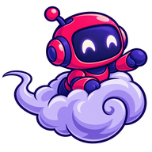

# CustomCloudBot



**내 서버, 내 AI, 내 이름으로 만드는 DIY 봇 플랫폼.** 대화와 공유 브라우저, 터미널, 파일을 한 화면에서 사용하고 필요한 모델과 외부 서비스를 연결합니다. 기본 이름은 CustomCloudBot이며, 관리자의 **내 봇 설정**에서 자신의 서비스 이름으로 바꿀 수 있습니다. 기본 아이콘은 핑크·인디고 구름봇입니다.

[처음 설치하기](docs/self-hosting-ko.md) · [앱 사용과 설정](apps/community/README.md) · [Docker 배포](apps/community/deploy/README.md) · [자동 배포](scripts/deploy/README.md)

## 내 환경으로 구성하기

Fork에는 운영 서버나 계정이 연결되어 있지 않습니다. 설치자가 클라우드, 도메인, AI 계정과 메일을 선택합니다. AI 키가 없어도 먼저 설치하고 로그인한 다음 **내 봇 설정**에서 연결할 수 있습니다.

| 선택할 항목 | 구성 방법 |
| --- | --- |
| 서버 | 자신의 Linux 서버·클라우드 VM·홈 서버에 설치 |
| 이름 | 관리자의 내 봇 설정에서 서비스 이름 지정 |
| AI API | 원하는 공급자의 키 또는 OpenAI 호환 endpoint·모델 등록 |
| 구독 계정 | 설치 후 지원되는 공식 CLI/OAuth로 로그인; 앱 사용에는 해당 실행 연결 필요 |
| 도메인 | 자신의 DNS와 HTTPS 프록시 설정 |
| 메일·캘린더 | 필요한 서비스의 별도 인증 정보를 비공개 Vault에 등록 |
| 작업 공간 | 설치자가 준비한 공유 Linux 컨테이너의 브라우저·터미널·파일 |

OCI와 Cloudflare, Groq·Gemini·Hugging Face를 조합할 수 있지만 필수 구성은 아닙니다. 무료 대상·크레딧·한도는 계정과 시점에 따라 달라집니다. 설치 가이드는 특정 사양이나 공급자의 영구 무료 사용을 보장하지 않습니다.

## 할 수 있는 일

| 기능 | 설명 |
| --- | --- |
| 대화 | 초대 계정, 대화별 참여 권한, 첫 메시지 제목, Fork·Compact·컨텍스트 초기화 |
| 대화 정리 | 고정·보관·그룹, 사이드바 크기 조절, 분할 보기 |
| AI 연결 | API 공급자 또는 전용 Gateway, 모델 선택과 연결 상태에 따른 순환 |
| 작업 공간 | Chrome 페이지 조작, xterm 터미널, 파일 목록·미리보기·다운로드 |
| 미디어 | 사진·음성 첨부와 녹음; 처리 범위는 연결된 모델·백엔드에 따라 결정 |
| 사용량 | 대화 맥락 추정치와 수집된 API 사용량·한도 |
| 대시보드 | 연결된 호스트의 CPU·메모리·디스크 상태 |
| 홈 화면 앱 | HTTPS 환경의 PWA와 선택적 Web Push |

여러 대화가 같은 작업 공간을 쓰면 브라우저 로그인 상태와 파일도 공유합니다. 대화·터미널 연결 권한은 로그인과 대화 참여 여부를 확인합니다.

## 로컬에서 시작하기

Docker가 있다면 서버 전용 설정 없이 앱부터 실행할 수 있습니다. 저장소 루트에서 시작합니다.

```sh
cd apps/community/deploy
cp .env.portable.example .env.portable
chmod 600 .env.portable
```

`.env.portable`의 `COMMUNITY_BOOTSTRAP_TOKEN`을 새 비공개 값으로 채운 뒤 실행합니다.

```sh
docker compose --env-file .env.portable -f compose.portable.yml config --quiet
docker compose --env-file .env.portable -f compose.portable.yml up -d --build
```

`http://127.0.0.1:8787`에서 관리자 계정을 만들고 **내 봇 설정**으로 이름과 AI를 연결합니다. 이 예제는 호스트 loopback에만 열리고 데이터를 `app-data` 볼륨에 보존합니다. 원격 작업 공간·공개 HTTPS·클라우드 자원은 만들지 않습니다.

### Node.js로 개발 실행

Node.js 24 이상에서 저장소 루트 기준으로 실행합니다.

```sh
npm ci --ignore-scripts
npm run build -w @open-grokbot/runner -w @open-grokbot/llm -w @open-grokbot/community
cp apps/community/.env.example .env
chmod 600 .env
```

`.env`의 `COMMUNITY_BOOTSTRAP_TOKEN`에 새로 만든 비공개 초대 값을 넣습니다. 이어서 실행합니다.

```sh
COMMUNITY_ORIGIN=http://127.0.0.1:8787 node --env-file=.env apps/community/server.mjs
```

`http://127.0.0.1:8787`에서 초대 값으로 최초 관리자 계정을 만들고 **내 봇 설정**을 엽니다. 이 로컬 실행만으로 원격 Linux 작업 공간이 생성되지는 않습니다. 브라우저·터미널·파일을 함께 쓰려면 [설치 가이드](docs/self-hosting-ko.md)의 Docker 구성을 완료하세요.

## 키와 데이터 유지

설정 화면에서 등록한 연결 정보는 데이터 디렉터리의 암호화 Vault에 저장합니다. `setup-vault.json`과 `setup-vault.key`를 함께 백업하고, 기존 환경 파일·통합 Vault·데이터 볼륨을 업그레이드 때 유지하세요. Fork나 업데이트는 키 삭제·재발급을 요구하지 않습니다. 클라우드와 도메인 입력은 배포 정보 관리이며 VM 생성이나 DNS 변경을 자동으로 실행하지 않습니다.

## 문서와 검증

- [Fork부터 운영까지](docs/self-hosting-ko.md)
- [앱 사용과 환경 변수](apps/community/README.md)
- [Docker 배포](apps/community/deploy/README.md)
- [Linux 작업 공간](apps/community/deploy/desktop/README.md)
- [main 자동 배포](scripts/deploy/README.md)
- [보안 정책](SECURITY.md)
- [CI 구성](.github/workflows/ci.yml)

```sh
npm run build
npm test
npm run typecheck
```

실제 모델 응답, CLI 구독 연결, 서버 자원과 기기 알림 수신은 자신의 배포 환경에서 확인하세요. 현재 파일은 특정 운영 계정을 기본값으로 쓰지 않으며, 이전 Git 이력의 배포 메타데이터까지 삭제한 것은 아닙니다.

## 라이선스 · 출처

[GNU GPL v3 only](LICENSE) (`GPL-3.0-only`). 공개 [LING71671/open-grokbot](https://github.com/LING71671/open-grokbot) 프레임워크를 바탕으로 공동 대화, 계정·초대, 미디어, 작업 공간, OpenClaw 연동과 PWA 기능을 추가했습니다. 이전 프로젝트 이름은 OpenClawBot입니다. 내부 패키지명, 배포 명령과 환경 변수 이름은 기존 설치 호환성을 위해 유지합니다. 원본의 저작권·라이선스 고지를 유지하며, 원본 상용 제품과 제휴하지 않고 유출 소스·자산·비공개 자격 증명을 포함하지 않습니다.
