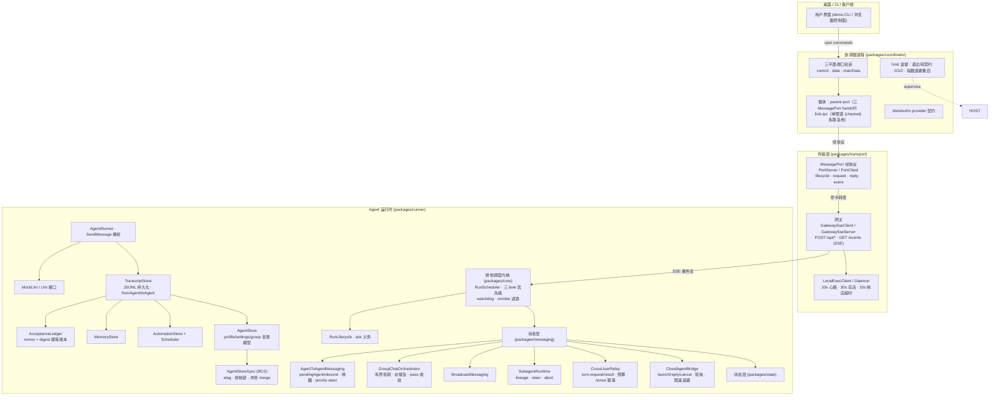

# Open-Grokbot

[English](README.md) | 简体中文

开源的多 agent 通信与协调框架 —— 对现代桌面 agent 平台（Grok Bot 类）架构的**全量还原实现**。
以逆向工程得到的架构为蓝图，完整重建其多 agent 系统的每一层：进程拓扑、端口协议、SSE 网关、排他调度、消息协议、群聊编排、跨用户房间、云 agent 桥、幂等账本与持久化状态。

> ## ⚠️ 重要声明
>
> **本项目是逆向工程（reverse engineering）还原的独立实现，不是原始源代码。**
> 本仓库的代码是基于对 Grok Bot（及其所基于的 Cursor 构建链）二进制产品的静态逆向
> 分析（解包、sourcemap 还原、架构梳理）后**重新编写（clean-room reimplementation）**的产物，
> 不包含原产品的任何源代码、资源或私有材料；架构与协议经逆向研究后以其公开行为为参照
> 独立实现。
>
> **许可证：GNU GPL v3 only（SPDX: GPL-3.0-only）**，详见 [LICENSE](LICENSE)。
>
> Grok Bot、Cursor 及其相关名称、商标、图形标志归其各自所有者所有；本项目不主张对上述
> 名称/商标的任何权利，也不与原产品存在从属或合作关系。本项目代码、命名与文档仅作
> 架构研究与工程参考。

## 架构总览



## 快速开始

```bash
npm install
npm run build          # 全量构建（tsc 项目引用）
npm test               # 全量测试（node:test）
npm run demo           # 运行完整演示：用户对话 + A2A + 群聊 + 广播
npm run start -w @open-grokbot/console   # 启动浏览器控制面（无 Electron）
```

演示输出示例：

```
--- 2. agent-to-agent: Alpha -> Beta ---
  ack: Sent to Beta. This is asynchronous; ...
  [beta/send-message] Thanks for the note, Alpha! I'll take a look.

--- 4. group chat: Squad discusses the roadmap ---
  [squad/group] Alpha: good point — @Beta what do you think?
  ...
```

## 接入真实 LLM（支持所有模型）

```ts
import { createLlm, createLlmFromEnv } from "@open-grokbot/llm";

// OpenAI 兼容协议：覆盖 OpenAI / DeepSeek / 豆包 / Moonshot / GLM / Grok /
// Ollama / vLLM 及一切 OpenAI 兼容端点
const deepseek = createLlm({
  provider: "openai-compatible",
  baseUrl: "https://api.deepseek.com/v1",
  apiKey: process.env.DEEPSEEK_API_KEY!,
  model: "deepseek-chat",
});

// Anthropic 协议
const claude = createLlm({
  provider: "anthropic",
  apiKey: process.env.ANTHROPIC_API_KEY!,
  model: "claude-sonnet-4-5",
});

// 环境变量驱动（console 默认路径）
// LLM_PROVIDER=anthropic  ANTHROPIC_API_KEY=…  ANTHROPIC_MODEL=…
// 或（默认）OPENAI_API_KEY=…  OPENAI_BASE_URL=…  OPENAI_MODEL=…
const llm = createLlmFromEnv();
```

控制台启动后打开 `http://127.0.0.1:<port>` 即可聊天（未配置 key 时回退 MockLlm）。

## 交付形态

本项目无 Electron 依赖，也不产出 EXE。交付形态：

- **CLI**：`npm run demo`（chat / a2a / group / broadcast / transcript 六命令）
- **浏览器控制面**：`npm run console` 启动 HTTP + SSE 控制面（apps/console），
  浏览器访问 `http://127.0.0.1:<port>` 即可与 agent 群聊天、发 A2A、广播、看实时事件流

架构上 shell 与运行时解耦：控制面只通过 HTTP/SSE 说话，所以未来换任何壳
（Node SEA、Bun compile、Tauri 等）都不需要改动 packages/* 一行代码。

## 包结构

| 包 | 职责 | 对应原版 |
|---|---|---|
| `@open-grokbot/core` | 排他运行队列（三 lane 优先级）、watchdog 逃逸、run 生命周期、重试/期限/空闲策略、事件总线 | dune scheduling + RunScheduler/RunLifecycle |
| `@open-grokbot/coordinator` | 协调器进程：三平面端口、双载体（parent-port / fork-ipc）、host 监督退出码契约、RPC 契约、WebAuthn | node-agent-coordinator / carrier / gateway-event-families |
| `@open-grokbot/transport` | MessagePort 帧协议（会话/违约/结算）、HTTP+SSE 网关（客户端与服务端）、16 事件族映射、local-exec 通道 | renderer-port-server / gateway-client / gateway-server / local-exec-gateway |
| `@open-grokbot/state` | transcript（JSONL）、acceptance 幂等账本、memory、automations、agent 目录存储、BCS 多端同步 | transcript / send-acceptance / memory / automations / agent-store-sync |
| `@open-grokbot/messaging` | A2A 私聊（队列+唤醒+优先级中断）、群聊编排、广播、subagent 运行时、跨用户房间 relay、云 agent 桥 | agent-to-agent-messaging / group-chat-orchestrator / background-wakes / subagent-runtime / cross-user-sharing / cloud-agents |
| `@open-grokbot/llm` | LLM 抽象、OpenAI 兼容 + Anthropic 双 provider、确定性 mock | chat-inference 适配层 |
| `@open-grokbot/runner` | turn 执行（SendMessage 提取）、SessionRuntime 装配根、GroupMemberRunner | sand-agent-runner / host 组合根 |
| `@open-grokbot/demo` | CLI：chat / a2a / group / broadcast / transcript | — |
| `@open-grokbot/console` | 浏览器控制面：HTTP API + SSE 实时推送 + 内嵌聊天 UI | — |

## 核心机制

- **排他运行队列**：每个 agent 一个队列，同一时刻一个活跃 turn；`user > agent > background` 三 lane 优先级，用户消息永远最先。
- **watchdog 逃逸**：卡死 run 进入 grace 窗口后被逃逸为 zombie——调用方 promise 立即返回（发送永不悬挂），删除/排空仍等待其真正结束。
- **A2A 消息**：fire-and-forget + 对称唤醒；priority 消息可中断接收方非用户工作（steer）；DM 抢占后 at-least-once 重驱（isRedriven 防环）；双侧 transcript 镜像 + 社交图谱。
- **群聊编排**：有界轮转（消息上限/轮次上限/全员 pass 收敛/用户消息 supersede），@提及路由，每成员独立会话状态。
- **跨用户共享房间**：hosted/mirror 房间、turn-request/turn-result 协议、10 分钟窗口 30 次预算、不可达退避、nonce 幂等。
- **云 agent 桥**：launch/reply/cancel/rename、10s 轮询、30s RPC 超时、5h 上限、60s±25% 限速抖动。
- **幂等发送**：clientNonce + inputDigest 持久化账本，超时重试零双发；durable acceptance 使发送与执行解耦。
- **广播**：用户→全员单向扇出，顺序调度、并发执行、无环。
- **subagent**：父 agent 派生的后台 run，lineage 世系、steer 转向、abort 中止。
- **多端同步（BCS）**：etag 条件写、排他变更锁、冲突 merge，两设备编辑同一 agent 收敛不覆盖。
- **持久化**：每 agent 独立目录（transcript.jsonl / memory.json / automations.json / profile.json / settings.json / group.json）。

## 文档

- [架构文档](docs/architecture.md) —— 进程拓扑、分层、数据流、消息路径（含多张时序图）
- [协议规范](docs/protocol.md) —— 帧协议、SSE wire、A2A/群聊/广播/xuser/云 agent 契约、幂等账本
- [还原度矩阵](docs/restoration-matrix.md) —— 原版模块 ↔ 实现文件 ↔ 测试覆盖 对照表

## 测试

```bash
npm test
```

覆盖：lane 优先级、排他性、watchdog 逃逸与 drain、端口协议违约、SSE 重连与 sendPrompt 幂等重试、transcript 持久化、账本去重/摘要不匹配/重启存活、A2A 唤醒/优先级中断、群聊收敛/上限、广播、subagent 生命周期、协调器双载体、跨用户 relay 预算/退避/幂等、云 agent 桥生命周期、local-exec 心跳/超时、BCS 冲突/锁、LLM provider 协议格式、端到端（用户→agent、A2A 唤醒回复、群聊）。8 个包共 84 项测试。

## 路线图

- [x] 真实 LLM 接入（OpenAI 兼容 + Anthropic）
- [x] 浏览器控制面（HTTP + SSE，无 Electron）
- [ ] Web UI 打磨（transcript 渲染、群聊视图、社交图谱）
- [ ] 协调器接入真实 utility 进程（Electron），或经解耦的 HTTP/SSE 表面接入任意壳

## 许可证

GNU GPL v3 only（SPDX: GPL-3.0-only）
